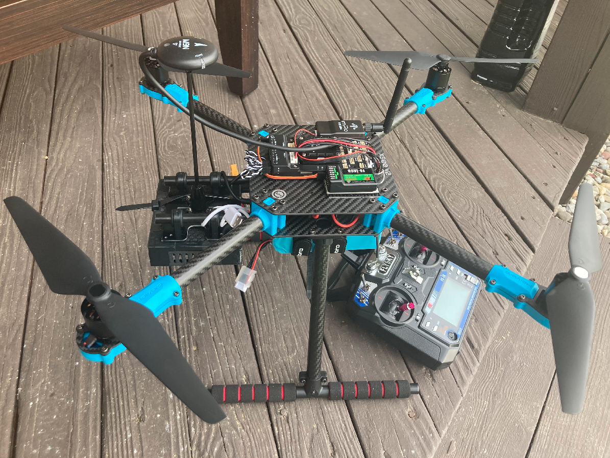

# Autonomous Quadrotor Control Library (AQC)

Repository developed by Nick Hinke for EN.530.707 Robot System Programming (Spring '22)

## README Contents
1. [Brief Description](#brief-description)
2. [Demo Videos](#demo-videos)
3. [Software Description](#software)
	1. [Dependencies](#software-dependencies)
	2. [Testing Installations](#testing-installations)
	3. [Using an Existing Input Client](#how-to-use-an-existing-input-client)
	4. [Writing a New Input Client](#how-to-write-a-new-input-client)
	5. [Full SITL Simulation](#configuring-and-running-sitl-simulation)
4. [Hardware Description](#hardware)
	1. [Requirements](#hardware-requirements)
	2. [Running AQC on Physical Hardware](#configuring-and-running-aqc-on-hardware)
5. [Future Work](#future-work)
6. [Overview of Each Package](#overview-of-each-package)
7. [Personal Remarks](#personal-remarks)

## Brief Description

The Autonomous Quadrotor Control Library (henceforth known as AQC), was created with the intention of making software development for autonomous quadrotors *easier*. AQC currently only targets the [PX4-Autopilot](https://px4.io/) software, but could be extended to additionally support [Ardupilot](https://ardupilot.org/). Additionally, despite its name, AQC supports any flavor of multicopter supported by PX4.

At its core, AQC exists to serve two main purposes:
1. Provide a framework within which to easily (and quickly!) develop deployable software that targets real, physical hardware.
2. Provide an interface that is agnostic to the output so that all of your code can remain exactly the same (with the exception of a single launch file) when switching between simulation and physical hardware.

To accomplish these objectives, AQC implements a variety of features that will help speed up your development of any autonomnous behaviors, including:
- A variety of controllers to which vehicle setpoints can be published (currently supports both position and velocity setpoints)
- A variety of servers capable of changing the state of the vehicle (e.g. arm/disarm the vehicle, change vehicle flight mode)
- A one-stop shop to retrieve useful information regarding the state of the vehicle
- An extensive set of chained launch files that allow you to launch everything you need for a full Gazebo simulation (or with real hardware!) with just one file
- Support for any type of input that you want to provide (see the [Future Work](#future-work) section)

In order to take advantage of these features, one need only launch the AQC driver (with your desired arguments set accordingly) on the appropriate device ([aqc_driver.launch](https://github.com/nhinke/rsp-project-repo/blob/master/aqc_driver/launch/aqc_driver.launch) for physical hardware, or [aqc_sim.launch](https://github.com/nhinke/rsp-project-repo/blob/master/aqc_driver/launch/aqc_sim.launch) for simulation). This will launch everything required for AQC to run as a "server side" for any autonomous behaviors, and will remain entirely consistent in its functionality across both physical hardware and Gazebo simulations. From there, you can either use one of the provided [example input clients](https://github.com/nhinke/rsp-project-repo/tree/master/example_aqc_input_clients) (see the [Using an Existing Input Client](#how-to-use-an-existing-input-client) section) to interact with AQC and control the vehicle, or define your own for your application (see the [Writing a New Input Client](#how-to-write-a-new-input-client) section).

Before jumping into more details, it is first necessary to make a quick disclaimer. Developing autonomous behaviors for aerial vehicles is inherently *dangerous*. There is certainly a tradeoff between flexibility of features and implemented safety measures, and AQC has not been rigorously tested at a production level. With that in mind, please perform any experiments with physical hardware at your own risk.

It should also be noted that AQC was created using ROS Melodic on Ubuntu 18.0.4 LTS, and its formatting was partially inspired by the ROS Industrial [universal robot meta-package](https://github.com/fmauch/universal_robot). 


## Demo Videos

See YouTube video descriptions at the links below for more information regarding each demo video.

1. [Demo1](https://youtu.be/1UGx2_VTam8) - brief hardware tour of physical hardware used to test AQC 
2. [Demo2](https://youtu.be/2gCSITocHEE) - demonstration of using one of the provided AQC [input clients](https://github.com/nhinke/rsp-project-repo/tree/master/example_aqc_input_clients) to publish position setpoints (the highest level of control available) from a laptop ground control station (GCS) to the AQC driver running on the vehicle's companion computer


## Software

### Software Dependencies

#### 1. [ROS Melodic](http://wiki.ros.org/melodic/Installation/Ubuntu) running on [Ubuntu 18.04 LTS](https://releases.ubuntu.com/18.04/)

#### 2. [QGroundControl](https://docs.qgroundcontrol.com/master/en/getting_started/download_and_install.html)

This is a ground control software that enables communication between a "ground control station" (GCS) and the flight controller unit (FCU). It also provides an easy interface to update firmware and/or configuration parameters of the FCU, and an extremely helpful GUI that displays a lot of information about the vehicle during flight (both in real life and in simulation). Note that the latest stable version of QGC only *officially* supports Ubuntu 20.0.4 and later due to video streaming issues, but I have had experienced no errors thus far. If you do encounter problems, older stable versions can be downloaded [here](https://github.com/mavlink/qgroundcontrol/releases/).

To install: 
```bash
sudo usermod -a -G dialout $USER
sudo apt-get remove modemmanager -y
sudo apt install gstreamer1.0-plugins-bad gstreamer1.0-libav gstreamer1.0-gl -y
sudo apt install libqt5gui5 -y
```

Log out and log back in for user permissions to change  
Download [QGroundControl.AppImage](https://d176tv9ibo4jno.cloudfront.net/latest/QGroundControl.AppImage)

To run:
```bash
chmod +x ./QGroundControl.AppImage
./QGroundControl.AppImage
```

#### 3. [PX4-Autopilot](https://docs.px4.io/master/en/dev_setup/building_px4.html)

This is the autopilot software that will be running on the FCU with real hardware, and that will be running "in-the-loop" during simulation. Alternatively, you could use [Ardupilot](#https://ardupilot.org/), but that will not be compatible with this repository.

To install:
```bash
git clone https://github.com/PX4/PX4-Autopilot.git --recursive
```

#### 4. [mavros](http://wiki.ros.org/mavros)

In short, this provides the necessary bridge for communication between ROS and the Pixhawk. In slightly more detail, the PX4-Autopilot software running on the Pixhawk communicates using the Mavlink protocol commonly used on drones (although I believe it is now capable of communicating with ROS2 directly). Mavros simply provides the bridge from any ROS communications to Mavlink communications.

To install:
```bash
sudo apt-get install ros-melodic-mavros ros-melodic-mavros-extras
```

#### 5. [GeographicLibDatasets](https://geographiclib.sourceforge.io/)

These are geographic datasets that are utilized by the ground control software.

To install:
```bash
wget https://raw.githubusercontent.com/mavlink/mavros/master/mavros/scripts/install_geographiclib_datasets.sh
sudo bash ./install_geographiclib_datasets.sh
```

#### 6. [AQC!](https://github.com/nhinke/rsp-project-repo)

To install:
```bash
source /opt/ros/melodic/setup.bash
mkdir -p catkin_ws/src && cd catkin_ws
git clone https://github.com/nhinke/rsp-project-repo.git src/aqc-repo
catkin build
source devel/setup.bash
```

See next section [here](#testing-installation) regarding how to test to ensure that everything was installed and set up correctly.

### Testing Installations

After doing all that work to install the dependencies and set up your environment, it would be certainly be a good idea to make sure it all works! If everything built correctly, you're already off to a great start. To truly test if everything is installed correctly, you can launch a slightly simplified version of the simulation that allows for inputs through the terminal window in which it was launched.

To launch:
```bash
# assuming you are starting in catkin_ws where aqc_repo was just built
chmod +x src/aqc-repo/scripts/test-sim-env.sh
./src/aqc-repo/scripts/test-sim-env.sh
```

Running this script should open QGroundControl and Gazebo, and you should see something akin to the following with the vehicle sitting in the middle of Decker Quad at JHU:

<p align="center">
  
</p>

As long as you ran the script in the foreground, hitting enter in the same terminal window from which you ran it should provide you with a command line interface designated by `pxh> `. This should allow you to control the vehicle in the simulation, which you can try by using commands such as `commander arm` and `commander takeoff`. For a full list of the available commands, simply enter `commander help`.

Note that the script used to launch this test simulation references [this script](https://github.com/nhinke/rsp-project-repo/blob/master/aqc_driver/scripts/launch-sim.sh) which is used to launch **all** simulations from within AQC. Notably, this script uses the shell command `locate` to find your installations of QGroundControl and PX4-Autopilot. If you find that this takes too long to launch the simulations, simply define the appropriate installations paths in that script.

### What is an Input Client?

As previously mentioned, the typical use case for AQC will first involve launching the aqc_driver (either the physical hardware version at [aqc_driver.launch](https://github.com/nhinke/rsp-project-repo/blob/master/aqc_driver/launch/aqc_driver.launch) or the simulation version at [aqc_sim.launch](https://github.com/nhinke/rsp-project-repo/blob/master/aqc_driver/launch/aqc_sim.launch)) to act as a server side running on the vehicle. Indeed, running this driver is what provides all of the functionality described above. After launching the driver, all of the necessary communications bridges have been made to the PX4 software stack, and so the system is just waiting for some good input commands. In order to provide these commands in a standardized way, we define the notion of an "input client" which is responsible for communicating all commands to the aqc_driver. While it is possible (and encouraged!) to define your own input clients specific to your application as will be discussed briefly [here](#how-to-write-a-new-input-client) and [here](#future-work), there are several pre-existing input clients that are ready for you to use right away. They can all be found in the directory titled [example_aqc_input_clients](https://github.com/nhinke/rsp-project-repo/tree/master/example_aqc_input_clients).

The reason for keeping these input clients separate from the rest of the AQC library is because, frankly, they do not belong in here. This is because for most applications, the companion computer onboard the vehicle will manage the aqc_driver and the ROS Master, but will never utilize one of these inputs clients (rather, they will only receive commands from them via pre-defined communication channels). Consequently, there is no reason to waste any memory on a resource-constrained companion computer, and they are only included in this repo for illustrative purposes. If you wish to use them, copy them into a different repository specific to your application and work with them there. That being said, however, if you wish to simulate both the input client and the aqc_driver on the same machine during development, it may make sense to keep the input clients here until it comes time to deploy your software onto physical hardware.

### How to Use an Existing Input Client

Using one of the pre-defined input clients is very straightforward, both in simulation and when using physical hardware (since not a *single* line of code in the input client needs to change!). Currently, there are three fully-implemented input clients provided [here](https://github.com/nhinke/rsp-project-repo/tree/master/example_aqc_input_clients), and one other work-in-progress. The three working clients are:

1. [aqc_input_raw_twists](https://github.com/nhinke/rsp-project-repo/tree/master/example_aqc_input_clients/aqc_input_raw_twists)  
	This
2. [aqc_input_dynamic_reconfigure_vel](https://github.com/nhinke/rsp-project-repo/tree/master/example_aqc_input_clients/aqc_input_dynamic_reconfigure_vel)  
	This
3. [aqc_input_dynamic_reconfigure_pos](https://github.com/nhinke/rsp-project-repo/tree/master/example_aqc_input_clients/aqc_input_dynamic_reconfigure_pos)  
	this 


### How to Write a New Input Client


### Configuring and Running SITL Simulation

TODO
basic sim to test functionality of aqc and input clients
not about being fancy or looking pretty
important thing is that your code will run exactly the same way in sim and in real life
future work: could make sim more realistc by including wind, noise in gps and other sensors, etc.
link [here](https://docs.px4.io/v1.12/en/simulation/gazebo.html) for how to do some of that and more


## Hardware

This section will focus exclusively on the hardware setup that I used for testing this library; however, there are infinitely many other hardware combinations (e.g. choice of airframe, companion computer, FCU, radios, etc.) that would be supported by this library.


<p align="center">
  
</p>

<p align="center">
  
</p>

<!-- <center></center>
<center></center> -->
<!--  -->
<!--  -->

### Hardware Requirements

requirements:
1. Companion Computer -- [NVIDIA Jetson Nano 2GB](https://www.nvidia.com/en-us/autonomous-machines/embedded-systems/jetson-nano/education-projects/)
2. Multicopter -- I used a [Holybro x500 v2 Quadrotor](http://www.holybro.com/product/x500-v2-kit/)
3. FCU -- I used a [Holybro Pixhawk5x](http://www.holybro.com/product/pixhawk-5x/)
4. GPS -- [Holyrbo M9N](http://www.holybro.com/product/holybro-m9n-gps/)
5. Telemetry radios -- I used [mRobotics 915 Mhz](https://store.mrobotics.io/mRo-SiK-Telemetry-Radio-V2-915Mhz-p/m10013-rk.htm)
6. RC receiver/transmitter -- [FlySky FS-i6](https://www.flysky-cn.com/i6-gaishu)
7. UART Connection -- [USB-to-TTL](https://www.amazon.com/dp/B07D6LLX19?psc=1&ref=ppx_yo2ov_dt_b_product_details)
8. Wifi adapter -- 802.11ac wifi adapter
9. Power -- lipo plus other peripherals (and jetson battery)


### Configuring and Running AQC on Hardware 

In order to use AQC with physical hardware, a multicopter equipped with a companion computer that supports ROS and WiFi networking (e.g. Raspberry Pi or NVIDIA Jetson) is required. Since AQC was designed to act as the "server side" for any autonomous behaviors, a collection of nodes within it will be running on the companion computer (which will be also hosting the ROS Master). To communicate with AQC, one need only connect their 

## Future Work


## Overview of each Package


## Personal Remarks
